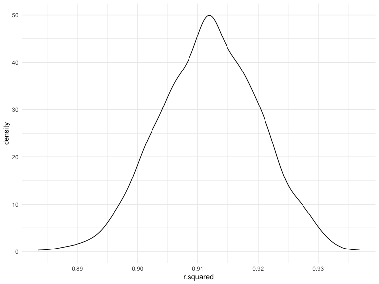
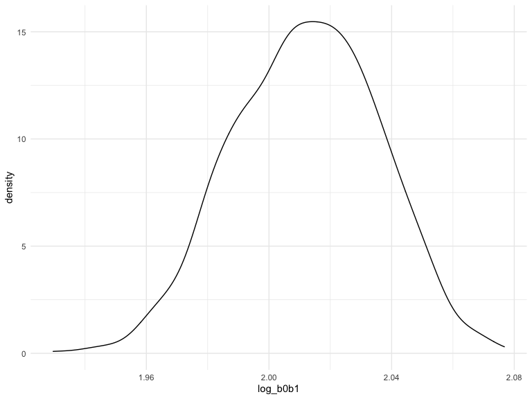
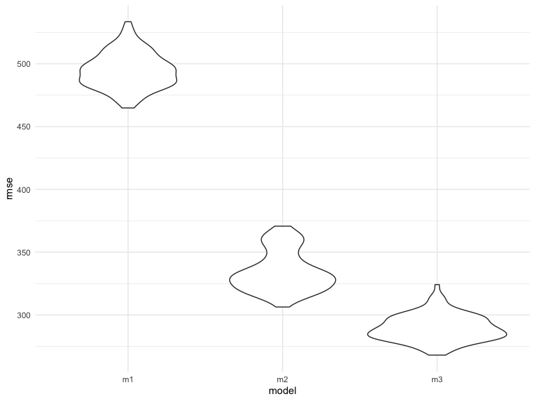

p8105_hw6_jc5924
================

### Problem 1

To obtain a distribution for $\hat{r}^2$, we’ll follow basically the
same procedure we used for regression coefficients: draw bootstrap
samples; the a model to each; extract the value I’m concerned with; and
summarize. Here, we’ll use `modelr::bootstrap` to draw the samples and
`broom::glance` to produce `r.squared` values.

``` r
weather_df = 
  rnoaa::meteo_pull_monitors(
    c("USW00094728"),
    var = c("PRCP", "TMIN", "TMAX"), 
    date_min = "2017-01-01",
    date_max = "2017-12-31") %>%
  mutate(
    name = recode(id, USW00094728 = "CentralPark_NY"),
    tmin = tmin / 10,
    tmax = tmax / 10) %>%
  select(name, id, everything())
```

    ## Registered S3 method overwritten by 'hoardr':
    ##   method           from
    ##   print.cache_info httr

    ## using cached file: ~/Library/Caches/R/noaa_ghcnd/USW00094728.dly

    ## date created (size, mb): 2022-10-14 17:45:03 (8.411)

    ## file min/max dates: 1869-01-01 / 2022-10-31

``` r
weather_df %>% 
  modelr::bootstrap(n = 1000) %>% 
  mutate(
    models = map(strap, ~lm(tmax ~ tmin, data = .x) ),
    results = map(models, broom::glance)) %>% 
  select(-strap, -models) %>% 
  unnest(results) %>% 
  ggplot(aes(x = r.squared)) + geom_density()
```



In this example, the $\hat{r}^2$ value is high, and the upper bound at 1
may be a cause for the generally skewed shape of the distribution. If we
wanted to construct a confidence interval for $R^2$, we could take the
2.5% and 97.5% quantiles of the estimates across bootstrap samples.
However, because the shape isn’t symmetric, using the mean +/- 1.96
times the standard error probably wouldn’t work well.

We can produce a distribution for $\log(\beta_0 * \beta1)$ using a
similar approach, with a bit more wrangling before we make our plot.

``` r
weather_df %>% 
  modelr::bootstrap(n = 1000) %>% 
  mutate(
    models = map(strap, ~lm(tmax ~ tmin, data = .x) ),
    results = map(models, broom::tidy)) %>% 
  select(-strap, -models) %>% 
  unnest(results) %>% 
  select(id = `.id`, term, estimate) %>% 
  pivot_wider(
    names_from = term, 
    values_from = estimate) %>% 
  rename(beta0 = `(Intercept)`, beta1 = tmin) %>% 
  mutate(log_b0b1 = log(beta0 * beta1)) %>% 
  ggplot(aes(x = log_b0b1)) + geom_density()
```



As with $r^2$, this distribution is somewhat skewed and has some
outliers.

The point of this is not to say you should always use the bootstrap –
it’s possible to establish “large sample” distributions for strange
parameters / values / summaries in a lot of cases, and those are great
to have. But it is helpful to know that there’s a way to do inference
even in tough cases.

### Problem 2

#### Tidy the data

``` r
homicides_df = read_csv("./data/homicide-data.csv")
```

    ## Rows: 52179 Columns: 12
    ## ── Column specification ────────────────────────────────────────────────────────
    ## Delimiter: ","
    ## chr (9): uid, victim_last, victim_first, victim_race, victim_age, victim_sex...
    ## dbl (3): reported_date, lat, lon
    ## 
    ## ℹ Use `spec()` to retrieve the full column specification for this data.
    ## ℹ Specify the column types or set `show_col_types = FALSE` to quiet this message.

``` r
homicides_summary=homicides_df%>% 
  mutate(city_state = str_c(city, state, sep = "_"),
         victim_age = as.numeric(victim_age),
         resolved = case_when(
           disposition == "Closed without arrest" ~ 0,
           disposition == "Open/No arrest" ~ 0,
           disposition == "Closed by arrest" ~ 1)) %>% 
  filter(victim_race %in% c("Black", "White"),
         !city_state %in% c("Dallas_TX", "Phoenix_AZ", "Kansas City_MO", "Tulsa_AL")) %>% 
   select(city_state, resolved, victim_age, victim_race, victim_sex)
homicides_summary
```

    ## # A tibble: 39,693 × 5
    ##    city_state     resolved victim_age victim_race victim_sex
    ##    <chr>             <dbl>      <dbl> <chr>       <chr>     
    ##  1 Albuquerque_NM        0         15 White       Female    
    ##  2 Albuquerque_NM        0         72 White       Female    
    ##  3 Albuquerque_NM        0         91 White       Female    
    ##  4 Albuquerque_NM        0         56 White       Male      
    ##  5 Albuquerque_NM        0         NA White       Male      
    ##  6 Albuquerque_NM        1         43 White       Female    
    ##  7 Albuquerque_NM        1         52 White       Male      
    ##  8 Albuquerque_NM        1         22 White       Female    
    ##  9 Albuquerque_NM        1         15 Black       Male      
    ## 10 Albuquerque_NM        1         25 Black       Male      
    ## # … with 39,683 more rows

#### Baltimore glm

``` r
baltimore= homicides_summary %>% 
  filter(city_state == "Baltimore_MD") %>% 
  glm(resolved ~ victim_age + victim_sex + victim_race, family = binomial(), data = .) %>% 
  broom::tidy()

baltimore_glm=baltimore %>% 
  mutate(odds_ratio = exp(estimate),
         CI_low = exp(estimate - 1.96 * std.error),
         CI_high = exp(estimate + 1.96 * std.error)) %>% 
  filter(term == "victim_sexMale") %>%
  select(term,odds_ratio, CI_low, CI_high) %>% 
  knitr::kable(digits = 3)
```

#### cities glm

``` r
cities_glm =homicides_summary %>% 
  nest(cities = -city_state) %>%
  mutate(models = map(.x =cities, ~glm(resolved ~ victim_age + victim_sex + victim_race, family = binomial(), data = .)),
         results = map(models, broom::tidy)) %>% 
  unnest(results) %>% 
  mutate(odds_ratio = exp(estimate),
         CI_low = exp(estimate - 1.96 * std.error),
         CI_high = exp(estimate + 1.96 * std.error)) %>% 
  filter(term == "victim_sexMale") %>% 
  select(city_state,odds_ratio, CI_low, CI_high)
cities_glm
```

    ## # A tibble: 47 × 4
    ##    city_state     odds_ratio CI_low CI_high
    ##    <chr>               <dbl>  <dbl>   <dbl>
    ##  1 Albuquerque_NM      1.77   0.831   3.76 
    ##  2 Atlanta_GA          1.00   0.684   1.46 
    ##  3 Baltimore_MD        0.426  0.325   0.558
    ##  4 Baton Rouge_LA      0.381  0.209   0.695
    ##  5 Birmingham_AL       0.870  0.574   1.32 
    ##  6 Boston_MA           0.674  0.356   1.28 
    ##  7 Buffalo_NY          0.521  0.290   0.935
    ##  8 Charlotte_NC        0.884  0.557   1.40 
    ##  9 Chicago_IL          0.410  0.336   0.501
    ## 10 Cincinnati_OH       0.400  0.236   0.677
    ## # … with 37 more rows

#### Plot the odds-ratio and CIs

``` r
odds_ratio_plot = cities_glm %>% 
  mutate(city_state = fct_reorder(city_state, odds_ratio)) %>% 
  ggplot(aes(x = city_state, y = odds_ratio)) +
  geom_point() +
  geom_errorbar(aes(ymin = CI_low, ymax = CI_high)) +
  theme(axis.text.x = element_text(angle = 90, vjust = 0.5, hjust = 1))+
  labs(
    title = "Plot of Estimates Odds Ratio and CIs",
    x = "City, State",
    y = "Odds Ratio") 
odds_ratio_plot
```


\* We can tell from the plot that most of the cities have an odds ratio
that is lower than 1 which means with adjusted age and race, the odds of
resolved homicides among males is lower than the odds of resolved
homicides among females. And some of the cities have odds ratio that are
higher than 1 which means that with adjusted age and race, the odds of
resolved homicides among males is higher than the odds of resolved
homicides among females.

### Problem 3

#### tidy

``` r
bw=read_csv("./data/birthweight.csv")
```

    ## Rows: 4342 Columns: 20
    ## ── Column specification ────────────────────────────────────────────────────────
    ## Delimiter: ","
    ## dbl (20): babysex, bhead, blength, bwt, delwt, fincome, frace, gaweeks, malf...
    ## 
    ## ℹ Use `spec()` to retrieve the full column specification for this data.
    ## ℹ Specify the column types or set `show_col_types = FALSE` to quiet this message.

``` r
bw_summary=bw %>% 
  mutate(babysex = as.factor(babysex),
         frace = as.factor(frace),
         malform = as.factor(malform),
         mrace = as.factor(mrace)) 
sum(is.na(bw_summary))
```

    ## [1] 0

#### residual plot

``` r
stepwise_model = step(lm(bwt ~ . ,data = bw_summary), direction = "both", trace = FALSE) 

plot =
  bw_summary %>% 
  add_predictions(stepwise_model) %>% 
  add_residuals(stepwise_model) %>% 
  ggplot(aes(x = pred, y = resid)) +
  geom_point(alpha = 0.5) +
  geom_smooth(formula = 'y ~ x',method = "lm", se = FALSE) +
  labs(title = "Predicted V Residuals",
       x = "Fitted", 
       y = "Residual",)
plot
```


\* We can tell from the plot that there is a cluster of points around
2000- 4000 and other points are evently distributed around 0.

#### Model 2&3

``` r
m2 = lm(bwt ~ blength + gaweeks, data = bw_summary)
m3 = lm(bwt ~ bhead + blength + babysex + bhead*blength + bhead*babysex + blength*babysex + bhead*blength*babysex, data = bw_summary)
```

#### 

``` r
bw_df= crossv_mc(bw_summary, 100) %>% 
  mutate(train = map(train, as_tibble),
         test = map(test, as_tibble)) %>% 
  mutate(m1_cv = map(train, ~lm(bwt ~ wtgain, data = .x)),
         m2_cv = map(train, ~lm(bwt ~ blength + gaweeks, data = .x)),
         m3_cv = map(train, ~lm(bwt ~ bhead + blength + babysex + bhead*blength + bhead*babysex + blength*babysex + bhead*blength*babysex, data = .x))) %>% 
  mutate(rmse_m1 = map2_dbl(m1_cv, test, ~rmse(model = .x, data = .y)),
         rmse_m2 = map2_dbl(m2_cv, test, ~rmse(model = .x, data = .y)), 
         rmse_m3 = map2_dbl(m3_cv, test, ~rmse(model = .x, data = .y)))
bw_plot = bw_df %>% 
  select(starts_with("rmse")) %>% 
  pivot_longer(everything(), 
               names_to = "model",
               values_to = "rmse",
               names_prefix = "rmse_") %>% 
  ggplot(aes(x = model, y = rmse)) + geom_violin()
bw_plot
```


